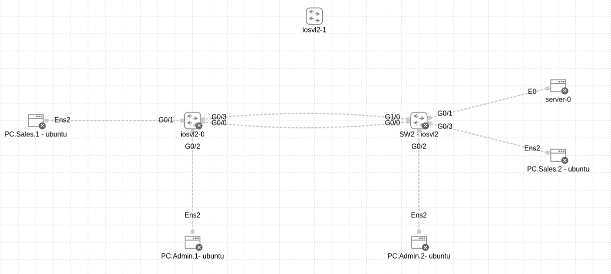

🎯 Project: Enterprise LAN Layer-2 Implementation

1. Project Overview (نظرة عامة) ✨:

تصميم وبناء شبكة محلية (LAN) لمؤسسة صغيرة باستخدام Cisco CML. يركز المشروع على تقسيم الشبكة (VLANs)، توفير الاعتمادية (Redundancy) باستخدام STP، وزيادة عرض النطاق (Bandwidth) باستخدام EtherChannel.

_______________________________________________

2. Network Topology & Addressing (العناوين والتصميم) 🧩

VLAN Schema:

VLAN ID

Name

Subnet

Devices

10

Sales

192.168.10.0/24

Sales PCs

15

Admin

192.168.15.0/24

Admin PCs

20

Server

192.168.20.0/24

Main Server

Device IPs:

Sales: 192.168.10.50

Admin: 192.168.15.70

Server: 192.168.20.100

__________________________________________

3. Implementation Steps (خطوات التنفيذ والأوامر) ⚙️

Basic Configuration & VLANs

إنشاء الفيلات وتعيين المنافذ للأجهزة.

! On Both Switches (SW1 & SW2)

vlan 10

name Sales

vlan 15

name Admin

vlan 20

name Server

! Example: Assigning Access Ports

interface g0/1

switchport mode access

switchport access vlan 10

exit

_____________________________________________________

تعيين عناوين IP يدوياً على السيرفر (TinyCore Linux):

sudo ifconfig eth0 192.168.20.100 netmask 255.255.255.0 up

طريقة تعيين عناوين IP على أجهزة PC:

sudo ip addr add 192.168.10.50/24 dev ens2

sudo ip link set ens2 up

لتعيين عنوان الـ Default Gateway على PC Ubuntu:

sudo ip route add default via 192.168.10.1

____________________________________________

4. EtherChannel (Link Aggregation) 🔗🔥

دمج منفذين فيزيائيين (G0/0, G0/1) ليعملا كمنفذ منطقي واحد (Po1) لزيادة السرعة ومنع اللوب.

! On Both Switches

interface range g0/0 - 1

channel-group 1 mode on

interface port-channel 1

switchport trunk encapsulation dot1q

switchport mode trunk

_____________________________________________________

4. Troubleshooting & Challenges (سجل المشاكل والحلول) 🛠️

هذا القسم يوضح العقبات التقنية التي واجهتها وكيفية حلها:

🧩 TinyCore Linux IP Command

المشكلة: محاولة استخدام أمر ip addr add لتعيين IP للسيرفر وظهر خطأ command not found.

السبب: توزيعة TinyCore خفيفة ولا تحتوي على حزمة iproute2 افتراضياً.

الحل: استخدام الأمر التقليدي ifconfig مع صلاحيات sudo.

🧩 Debug Command in Config Mode:

المشكلة: محاولة تشغيل debug spanning-tree events داخل وضع (config)# وفشل الأمر.

السبب: أوامر debug تعمل في وضع الامتياز (Privileged Exec Mode).

الحل: استخدام do debug ... أو الخروج للوضع الرئيسي.

🧩 EtherChannel Suspension (LACP vs Static):

المشكلة: عند استخدام LACP (mode active)، ظهرت حالة المنافذ (s) أي Suspended.

السبب: فشل التفاوض بين السويتشات الافتراضية أو عدم تطابق لحظي في الإعدادات.

الحل:

إزالة إعدادات LACP

استخدام Static Mode عبر mode on

هذا الوضع يجبر السويتشات على الدمج بدون بروتوكول تفاوض

______________________________________________

5. Verification Commands (أوامر التحقق) ✔️

للتحقق من صحة العمل:

show vlan brief : للتأكد من توزيع المنافذ

show interfaces trunk : للتأكد من حالة الترنك

show spanning-tree vlan 1 : لمعرفة الـ Root Bridge وحالة المنافذ

show etherchannel summary : للتأكد من نجاح الدمج (الرمز P)

